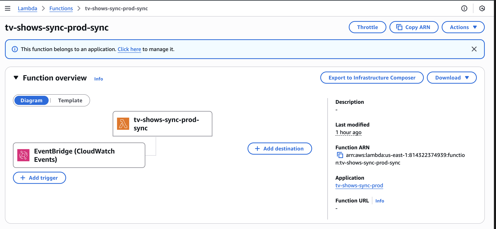
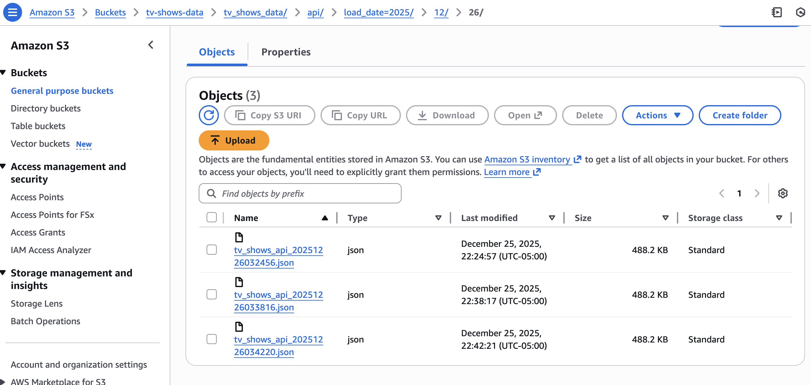
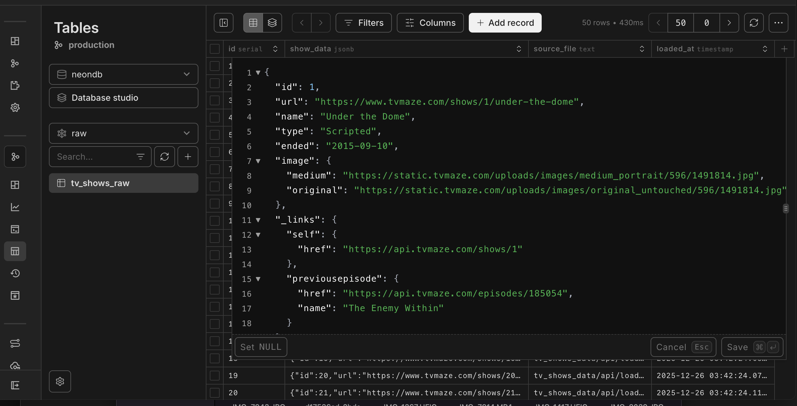
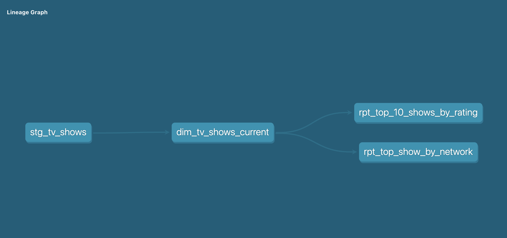
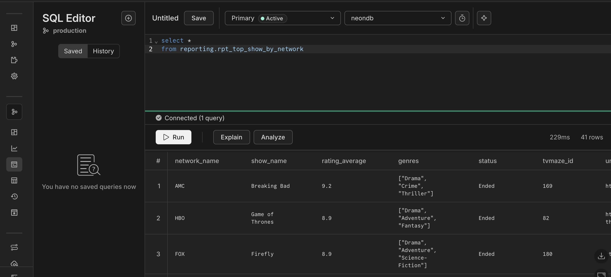
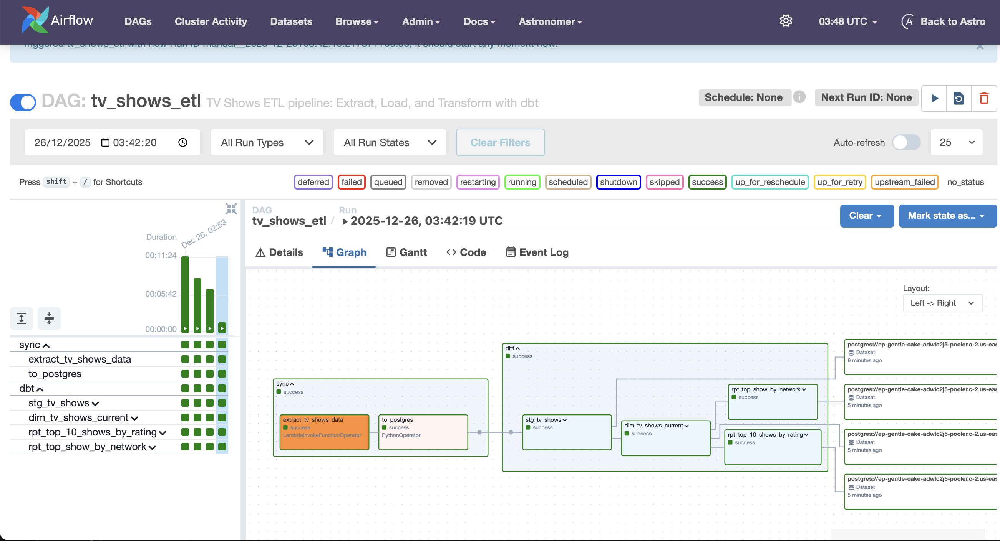

# TV Shows Data Pipeline

Project built for fun and learning to create an end-to-end data pipeline that extracts, transforms, and loads sample TV shows data.

## Description

This project implements an ETL pipeline that:
- **Extracts** sample TV shows data from TVMaze API using AWS Lambda
- **Stores** data in AWS S3
- **Transforms** data using dbt
- **Loads** transformed data into PostgreSQL (Neon)

The pipeline is orchestrated with Apache Airflow deployed on Astronomer.

## Technologies

- **AWS**: Lambda, S3, IAM, ECR
- **Docker**: Containerization for Lambda functions
- **dbt**: Data transformation
- **PostgreSQL**: Database (Neon)
- **Apache Airflow**: Orchestration (deployed on Astronomer using their free trial)
- **Cosmos**: dbt integration with Airflow
- **Serverless Framework**: Infrastructure as code

## Architecture

1. **Extract**: AWS Lambda executes a Python script (containerized with Docker and stored in ECR) that fetches data from TVMaze API and uploads to S3

2. **Store**: Data is stored in AWS S3 bucket

3. **Load**: Airflow DAG loads data from S3 to PostgreSQL (raw schema)

4. **Transform**: dbt transforms data in layers (staging → marts → reporting)

## Prerequisites

To run this project locally, you need:

- **Python 3.12+**: For running the extraction script
- **AWS Account**: With IAM user having the following policies:
  - `AmazonEC2ContainerRegistryFullAccess` (for ECR)
  - `AWSCloudFormationFullAccess` (for Serverless Framework)
  - `AWSLambda_FullAccess` (for Lambda functions)
  - `IAMFullAccess` (for creating IAM roles)
  - `CloudWatchEventsFullAccess` (for EventBridge)
  - `AmazonS3FullAccess` (for S3 bucket operations)
  - `CloudWatchLogsFullAccess` (for Lambda logs)
- **Database**: For this project, we used Neon (serverless PostgreSQL) for quick setup, but any compatible database would work (PostgreSQL, Snowflake, BigQuery, etc.)
  - **Note**: Both the schema (`raw`) and table (`raw.tv_shows_raw`) must be pre-created manually before running the pipeline. The SQL script (`sql/create_tv_shows_raw_table.sql`) should be executed once. Schema and table creation are not handled by the DAG tasks.
- **dbt**: Installed with the appropriate adapter (`dbt-postgres`, `dbt-snowflake`, `dbt-bigquery`, etc. depending on your database choice)
- **Docker**: Required for building Lambda container images and deploying to ECR (used by GitHub Actions workflows)

## Running on Astronomer

To deploy and run the pipeline on Astronomer:

1. **Create Astronomer account**: Sign up for an Astronomer account (I used the free trial)
2. **Create a workspace**: Create a new workspace in Astronomer
3. **Connect repository**: 
   - Link your GitHub repository to Astronomer
   - Configure the DAGs path (typically `dags/`)
4. **Create Airflow connections** in Astronomer UI:
   - **aws_conn**: 
     - Connection Type: `Amazon Web Services`
     - Configure with your AWS credentials (Access Key ID, Secret Access Key, Region)
   - **neon_postgres**: 
     - Connection Type: `Postgres`
     - **Important**: In Airflow, the `Schema` field is used as the database name. Set `Schema` to your Neon database name
     - Configure Host, Login, Password, Port, and Extra (with SSL settings)
   - **Enable "Associate with all Deployments"**: Check this option for both connections so they're available to all deployments
5. **Create deployment**: Create a new deployment in Astronomer
6. **Access Airflow**: Once deployed, open the Airflow UI and you should see the `tv_shows_etl` DAG

7. **Execute DAG**: Trigger the DAG manually or wait for scheduled execution

**Note**: Ensure AWS infrastructure (Lambda function, S3 bucket) is deployed before running the DAG, as it will invoke the Lambda function.

## GitHub Actions

GitHub Actions workflows are configured for CI/CD automation:

- **Automatic execution**: Workflows run automatically on push to `main` or `develop` branches
- **Build workflow** (`.github/workflows/build-only.yml`): Builds Docker image and pushes to ECR
- **Deploy workflow** (`.github/workflows/deploy.yml`): 
  - Builds Docker image and pushes to ECR
  - Deploys infrastructure to AWS using Serverless Framework
  - Creates/updates Lambda function, IAM roles, and EventBridge schedule

**No manual execution needed**: The workflows run automatically when you push code to the repository. Ensure GitHub secrets are configured (`AWS_ACCESS_KEY_ID`, `AWS_SECRET_ACCESS_KEY`, `S3_BUCKET`).

## Running Locally

### Running Individual Components

1. **Setup environment**: Create a virtual environment and install dependencies from `requirements.txt`
2. **Configure AWS credentials**: Set up AWS credentials via `.env` file or environment variables (`AWS_ACCESS_KEY_ID`, `AWS_SECRET_ACCESS_KEY`, `AWS_DEFAULT_REGION`, `S3_BUCKET`)
3. **Run extraction script**: Execute `python lambda/sync_tv_shows_data.py` to fetch data from TVMaze API and upload to S3
4. **Setup dbt**: Configure `dbt/profiles.yml` with your PostgreSQL connection details and set environment variables (`NEON_HOST`, `NEON_USER`, `NEON_PASSWORD`, `NEON_DATABASE`)
5. **Run dbt models**: Navigate to `dbt/` directory and run `dbt run` to execute transformations

### Running the Complete DAG Locally

**Important**: Before running the DAG locally, you must deploy the AWS infrastructure first (Lambda function, S3 bucket, IAM roles). This can be done by:
- Pushing code to trigger GitHub Actions workflows (automatic deployment), or
- Manually running `serverless deploy` after building and pushing the Docker image to ECR

To run the full Airflow DAG locally:

1. **Deploy AWS infrastructure**: Ensure Lambda function is deployed (via GitHub Actions or manual deployment)
2. **Install Airflow**: `pip install apache-airflow` (or use the dependencies from `requirements.txt`)
3. **Initialize Airflow database**: `airflow db init`
4. **Create Airflow connections**:
   - **aws_conn**: Connection Type `Amazon Web Services` with your AWS credentials
   - **neon_postgres**: Connection Type `Postgres` with your Neon database credentials
5. **Start Airflow webserver**: `airflow webserver --port 8080`
6. **Start Airflow scheduler**: `airflow scheduler` (in a separate terminal)
7. **Access Airflow UI**: Open `http://localhost:8080` and trigger the `tv_shows_etl` DAG
